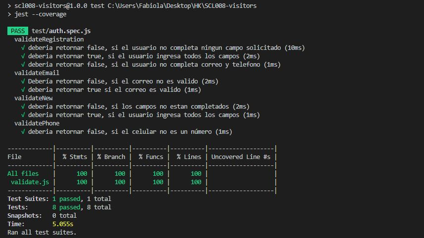

# Proyecto PaseNoma'

## Preámbulo

Seguramente te ha ocurrido que vas con el tiempo justo para llegar a una cita de trabajo, pero oh sorpresa!, justo cuando creías lograrlo te encuentras con el último obstáculo: registrarse para poder entrar D:!, ves una fila de personas formadas para el registro y de repente quisieras que la recepcionista fuera una máquina súper rápida que aparte escribiera tu nombre y correo de la forma correcta.

[PaseNoma'](https://fabytapia.github.io/SCL008-visitors/) es una aplicación desarrollada para tablets que facilitará tu registro y lo guardará de manera eficiente,. No solo será una ventaja para ti, sino también para la recepcionista que no es una máquina, pero que puede usar una para beneficiar su trabajo. 

## Planificación 🚀

La planificación fue realizada en trello, la cual puedes revisar [aquí](https://trello.com/b/46lkgMpe/visitors).

## Usuarios 👪

Lo primero y esencial es conocer al usuario. Para ello se realizó una [entrevista](https://photos.app.goo.gl/poKEZtnMBKzwXvUJ8) en la que se pudo identificar las siguientes respuestas:

- Seria ideal tener una base de datos de todas las empresas,y encargados de recibir las visitas 

- Si bien entre mas rápido sea la recepción de visitas mejor es el flujo, por lo que seria mas dinámico.

- Uno de los principales problemas fue que no llevan control de salida de las visitas, por lo que si hacen mejoras digitales de recepción seria un buen punto para solucionar. 

### Fase de Prototipo 📋

Una vez reconocido el usuario, comienza el proceso creativo compuesto por diferentes pasos que buscan dar con un resultado esperado por nosotras, pero principalmente pensado para el usuario. 

**¿Cuál es la necesidad de nuestros usuarios?**

A partir de la encuesta realizada nacen distintas historias de usuario (**HU**) que describen las necesidades de los usuarios, buscando cubrirlas a partir de los criterios de terminado (**CT**) que se desarrollan en cada una de ellas.

**1) COMO** visitante del edificio **QUIERO** poder registrar mi ingreso, **PARA** poder controlar mi estadía en el lugar.

**2) COMO** administrador **QUIERO** registrar los usuarios del coworking que trabajan en el edificio, **PARA** que el registro de quienes reciban visitas sea más rápido y expedito.

**3) COMO** administrador **QUIERO** visualizar a los visitantes, **PARA** para acceder a su registro de manera más sencilla.

**4) COMO** administrador **QUIERO** visualizar los horarios más frecuentes de visita, **PARA** ver si es necesario contar con más equipos para registrar a los visitantes.

Los criterios de terminado para estas HU son:

- Realizar test de usabilidad
- Realizar Test unitarios
- Etiquetar cada historia terminada con git-tag
- Se debe acceder a la aplicación desde una tablet (debe ser responsivo)

## Prototipo de Baja Fidelidad

Una vez reconocido el usuario, comienza el proceso creativo de prototipo de baja fidelidad, el cual fue realizado en [figma](https://www.figma.com/file/dzD14n5Y14JQSQThrLx3UStC/Visitors?node-id=0%3A1); destacando las principales vistas:

- Registro de visitantes.
- Registro de empleados.
- Historial de visitantes.

### Consideraciones en el desarrollo 🛠️

**Ejecución del interfaz de usuario HTML, CSS, JS**

* La lógica del proyecto fue implementada usando JS, HTML y CSS, usando como framework de estilos [Bootstrap](https://getbootstrap.com/) 

**Implementación de la interfaz**

* Se usó [firebase](https://firebase.google.com/?gclid=Cj0KCQjw7sDlBRC9ARIsAD-pDFo4o3bi6laUeK0Hppr0Y6-QeRkx5bdtpUH2uak61pvLXOcA5KeLDSQaAkV2EALw_wcB)
como plataforma de desarrollo.
* Creación de distintas vistas, gestionadas por un archivo (router.js) que permite su visualización, dependiendo de las elecciones del usuario.
* Desarrollo de funciones para que el visitante pueda registrar su visita utilizando la base de datos [cloud firestore](https://firebase.google.com/docs/firestore/?hl=es-419).
* Guardar fotografiá del visitante, usando [cloud storage](https://firebase.google.com/docs/storage/?hl=es-419).
* Desarrollo de funciones para que el administrador pueda registrar a empleados que trabajen en el edificio.
* Desarrollo de funciones para que el administrador pueda acceder a la ficha de los visitantes registrados.
* Implementación de validaciones; como es el caso de campos vacíos, formato de correo electrónico y formato de número de celular. Todo esto testeado en el archivo auth.spec.js.
* Manejo de estilos CSS pensado en mobile first; usando bootstrap.
* Testeo de usabilidad y code review por cada historia de usuario finalizada.
* Trabajo colaborativo mediante el uso de Git y GitHub :octocat:, realizando realeses por cada historia de usuario terminada. 
* Deploy con gh-pages de la aplicación [PaseNoma'](https://fabytapia.github.io/SCL008-visitors/)
* Deploy con firebase de la aplicación [PaseNoma'](https://visitors-hackathon.firebaseapp.com/)

**Implementación de vistas**

* *templateSession:* vista que permite al usuario acceder a la opción de visitante y administrador.

* *templateVisitorRegistration*: vista que permite al visitante realizar el registro. No puede existir campos vacíos y respetar el formato para correo electrónico y celular. Además, permite tomar una fotografía la que se puede guardar en firebase storage.

* *templateAdminOptions*: vista que permite al administrador elegir la vista que desea desplegar.

* *templateNewCoworker*: vista que permite al administrador ingresar a un empleado del lugar, identificando su empresa. No puede existir campos vacíos y respetar el formato para correo electrónico y celular.

* *templateVisitorRecord*: vista que permite al adminitrador las fichas de los visitantes.

**Implementación de funciones**💻

Las principales funciones de [PaseNoma'](https://fabytapia.github.io/SCL008-visitors/) se encuentran desarrolladas en el archivo *datamodel.js*.

* *visitorCreate(visitorFirstName, visitorLastName, visitorEmail, visitorPhone, companyName, companyPerson, companyPersonId, photo)*, necesaria para registrar un visitante.

* coworkerCreate(coworkerFirstName, coworkerLastName, coworkerEmail, coworkerPhone, coworkerCompany)*, necesaria para registrar un empleado.

* *postVisitor*, permite leer desde firebase los datos del visitante y mostrarlos en una vista.

**Aspectos técnicos**

* Se realizó test para comprobar el funcionamiento de la aplicación, logrando los siguientes resultados: 

- % Statements: 100; % Branch: 100; % Functions: 100; % Lines: 100
 

### Futuras mejoras ⌨️

* Implementar la opción de obtener estadísticas.

### Autoras 📌

* Fabiola Orellana 
* Fabiola Tapia
* Stephanie Mayen

8° Generación de Laboratoria.

Mayo, 2019.